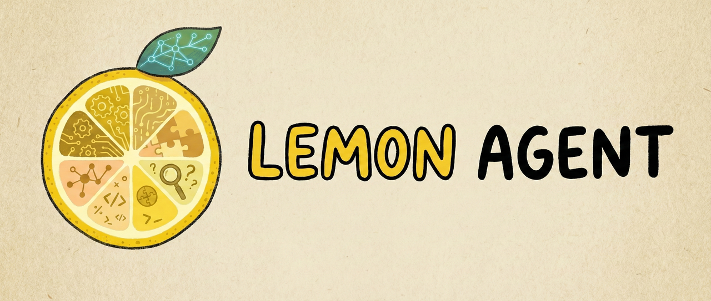
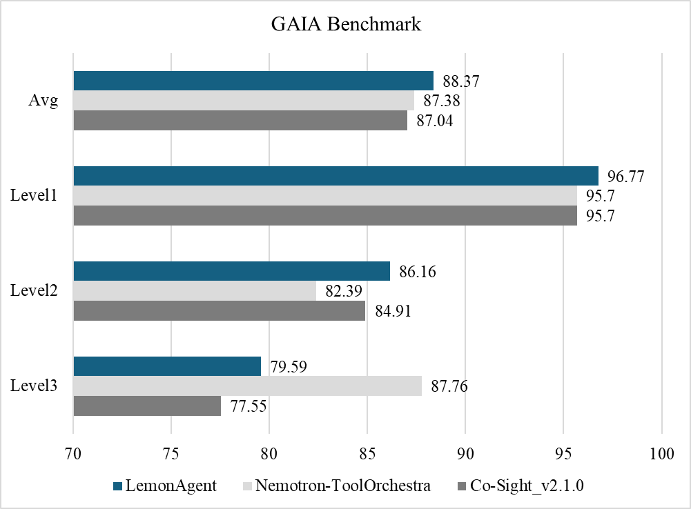
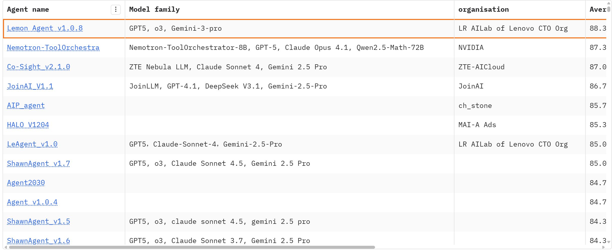
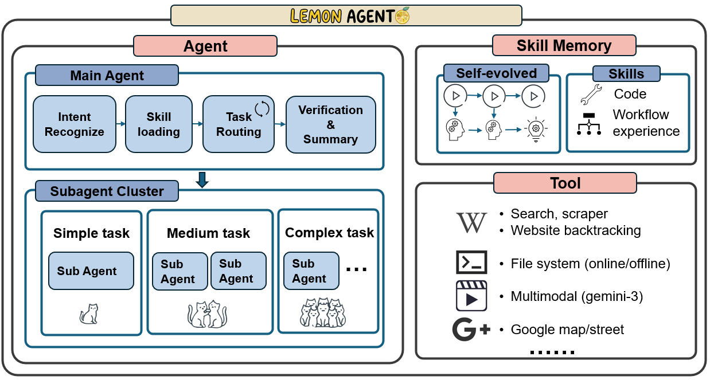

# LemonAgent
---

[English Version](./README.md)|中文版本

# Introduction
在人工智能从概念验证走向产业级规模化落地的阶段，Agent 系统的核心问题已从“能不能做”转为“能否以成本可控、工程可控且可持续演进的方式大规模做对”。传统单体 Agent 在算力开销、场景定制和跨任务复用上已显露天花板。为此，我们提出面向产业级 Agent 的 **“协作进化–经济高效–环保感知”** 三位一体范式：（1）多智能体动态协同与角色分工，叠加统一记忆与经验共享，形成群体智能，在真实业务闭环中持续进化，突破单体在深度推理与任务泛化上的上限。（2）以“任务效果 × 算力开销”共优为目标，采用算力感知模型选择与推理深度控制、Planner–Executor 解耦及工具/记忆跨任务复用，显著提升单位算力产出。（3）将能耗与碳排放纳入系统级约束，通过推理路径、模型规模与资源调度协同优化，减少无效计算，沉淀可复制的绿色智能体工程范式。

LemonAgent作为上述“三位一体”设计范式的核心落地载体，是一款通用型多智能体框架。其多智能体、memory、工具等模块呈分瓣协作状态，共同组成一个有机整体。这种分瓣协作的模式恰似柠檬的多瓣果肉，“LemonAgent”的命名也正源于此。为验证LemonAgent的通用适配能力，我们在GAIA榜单测试集（Test Set）止12月4日取得88.37%的准确率，各层级具体得分如下：Level 1得分96.77%、Level 2得分86.16%、Level 3得分79.59%，展示了我们自研Reasoning Agent系统在长链条复杂任务推理方面的初步进展。

我们计划于近期开源 **LemonAgent**，将其作为面向多智能体协作与记忆增强推理的基础设施，开放给全球开发者与研究社区研究、复现与二次开发。本次开源版本在工程与研究上主要体现为两大技术支柱：

1. **多智能体编排架构：** LemonAgent 采用统一的 *Planner–Executor–Memory* 架构，兼容协作式、分层式、工具中枢式等多种多智能体设计模式，提供统一的上下文与记忆视图，以及面向复杂业务流程的高并发 DAG 执行引擎与任务路由机制，使不同规模、不同拓扑的智能体群能够以配置化方式快速装配与演化。

2. **子智能体–记忆–工具一体化调度：** 基于我们在长时记忆、工具增强推理与协作式智能体上的实践，LemonAgent 将子智能体、分层记忆（短时/长时/检索式）与工具模块纳入统一的自适应调度子系统：通过对任务内容、历史交互轨迹与环境信号的联合评估，由策略调度器自适应选择参与协同的子智能体集合，动态调节其能力配置（模型规格、推理深度、工具权限与记忆检索范围等），在保证任务质量的同时显著压缩冗余算力开销。     
借助上述设计，LemonAgent 既可作为工业级 GAIA Agent 的参考实现，也可作为学术界与产业界开展多智能体协同、记忆增强推理与经济高效推理策略研究的开源实验底座。

# GAIA bechmark

# Architecture

### Agent
  - 对用户query进行意图识别，对历史技能记忆进行检索，动态挂载最佳匹配的技能记忆，路由任务，对任务验证和总结。
  - 在路由任务时，主智能体根据上述信息，对任务进行拆解，规划出可执行的步骤，并且根据步骤的难度（复杂度）进行不同的子智能体组配置和任务分发，在子智能体中进行高并发DAG执行。
### Skill Memory
  - __自进化闭环__：任务结束后，主智能体会从执行的过程以及结果（如果有）提取有价值的信息回写到技能记忆模块中，实现自进化的闭环。
### Tool
  - __统一的工具层__：所有的智能体均通过MCP协议调用工具。

# Highlights
1. **多智能体协作：** 多个智能体之间共同协作处理任务，相互校验和补充信息，实现最终结果性能提升。

2. **自适应智能体调度：** 根据任务的复杂（难易）程度决定处理任务的智能体数量和使用的模型，实现自适应的环境友好型的智能调度，在性能和成本之间实现最佳平衡

3. **自进化技能记忆：** 不单一依赖于ground truth进行记忆模块的更新，而是多维度地从智能体的工作流程和工具执行中来提取有价值的模块，从而实现记忆模块的自进化。

4. **工具增强：**
   * 模态（音频/视觉）方向工具增强
   * 网络回溯工具的增强等。
# TODO List
* [ ] 技术报告 V1 版本即将推出
* [ ] 代码即将推出

# Project Co-developer
**贡献者：** Haipeng Jiang, Kailong Ren, Zimo Yin, Zhetao Sun, Guangyi Lv, Ming He, Peng Wang, Congli Yin, Hong Pan, Changwen Zhang, Shan Tong, Zhengyu Xu
**所属机构：** Lenovo Research AILab of Lenovo CTO Org